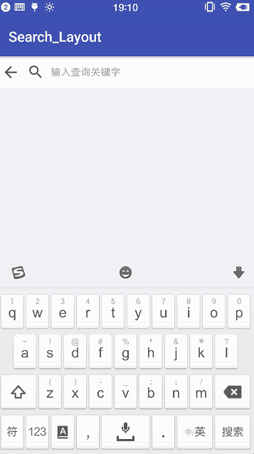
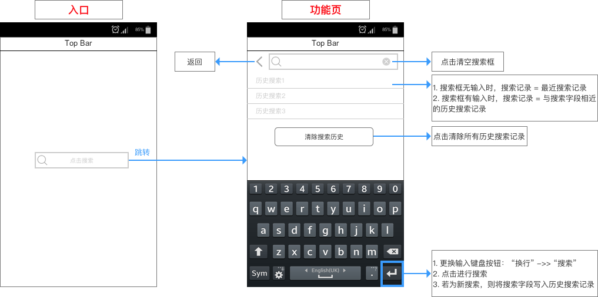

# SearchLayout
- 原作者：Carson_Ho
- 修改者：LiYing（独毒火）

**注：关于该开源项目的意见 & 建议可在 Issue 上提出。欢迎 Star ！**

## 1. 简介
一款**封装了 历史搜索记录功能 & 样式** 的 `Android` 自定义搜索框。

>已在 `Github` 开源：[地址：SearchLayout](https://github.com/liying2008/Search_Layout)，欢迎 `Star` ！





## 2. 功能介绍
### 2.1 需求场景

1. **主要：** 对某类事物进行精确搜索；
1. **次要：** 降低二次搜索的操作成本。

### 2.2 功能需求
- 功能列表

<table>
<tr>
    <th>需求场景</td>
    <th>功能</td>
    <th>描述</td>
    <th>优先级</td>
</tr>
<tr>
    <td>（<strong>主要</strong>）对某类事物进行精确搜索</td>
    <td>关键字搜索</td>
    <td>根据用户的关键字输入进行数据库查找</td>
    <td>P1</td>
</tr>
<tr>
    <td rowspan="4">（<strong>次要</strong>）降低二次搜索的操作成本</td>
    <td>实时显示历史搜索记录</td>
    <td>包括：最近搜索记录 & 相似搜索记录（根据用户输入）</td>
    <td>P2</td>
</tr>
<tr>
    <td>保存历史搜索记录</td>
    <td>将用户的搜索字段进行保存（以点击搜索按钮为准）</td>
    <td>P3</td>
</tr>
<tr>
    <td>删除历史搜索记录</td>
    <td>将数据库中保存的历史搜索记录清空</td>
    <td>P4</td>
</tr>
<tr>
    <td>一键删除输入搜索关键词</td>
    <td>将用户当前输入的搜索关键词清空</td>
    <td>P5</td>
</tr>
</table>

- 功能原型




## 3. 特点
### 3.1 功能实用
- 该搜索框开源库具备除了历史搜索记录功能外，还具备一般的搜索框功能（如一键清空搜索框内容等等）
- 封装了 **常见的搜索框样式**（如图标、字体、背景等等），使用起来更加方便

### 3.2 使用简单
仅需要简单的 `xml` 属性配置

>下面1节会详细介绍其使用方法

### 3.3 二次开发成本低

- 本项目已在 `Github` 上开源：[地址：SearchLayout](https://github.com/liying2008/Search_Layout)

- 具备详细的源码分析文档：请看原作者 Carson_Ho 的文章 [Android开源库：手把手教你实现一个简单好用的搜索框（含历史搜索记录）](http://www.jianshu.com/p/590f00025de3)


# 4. 具体使用

该款 SearchView 使用非常简单，仅需2步：

### 步骤1：引入控件库
主要有 `Gradle` & `Maven` 2种方式：

- 方式1：`Gradle`引入依赖

*build.gradle*

```gradle
dependencies {
    implementation 'cc.duduhuo:search-view:1.1.0'
}
```

- 方式2：`Maven`引入依赖

*pom.xml*

```xml
<dependency>
  <groupId>c.duduhuo</groupId>
  <artifactId>search-view</artifactId>
  <version>1.1.0</version>
  <type>pom</type>
</dependency>
```


### 步骤2：设置搜索框样式

- 自定义属性列表

| 属性 | 描述 | 类型 | 默认值 |
| :------:| :------: | :------: |:------: |
| searchTextSize | 搜索字体大小 | dimension | 12sp |
| searchTextColor | 搜索字体颜色 | color | #9B9B9B |
| searchTextHint | 搜索框编辑框提示内容 | string |输入查询关键字 |
| searchTextBackground | 搜索编辑框背景 | reference | 0 |
| searchBlockColor | 搜索控件背景颜色 | color | #FFFFFF |
| searchBlockBackground | 搜索控件背景 | reference | - |
| searchBlockHeight | 搜索控件高度 | dimension |wrap_content |
| searchButtonText | 搜索按钮文字 | string |搜索 |
| searchButtonBackground | 搜索按钮背景 | reference |0 |
| searchButtonTextColor | 搜索按钮文字颜色 | color |pressed: #888888<br>normal: #606060|
| searchButtonTextSize | 搜索按钮文字大小 | dimension |12sp |
| searchButtonWidth | 搜索按钮宽度 | dimension |60dp |
| searchButtonVisible | 搜索按钮是否可见 | boolean |false |
| iconColor | 所有图标的颜色 | color |#535353 |
| backIconColor | 返回图标的颜色 | color |#535353 |
| searchIconColor | 搜索图标的颜色 | color |#535353 |
| deleteIconColor | 删除图标的颜色 | color | #535353|
| searchIconVisible | 搜索图标是否可见 | boolean |true |
| clearHistoryText | 清除历史记录文字 | string |清除搜索历史 |
| clearHistoryTextColor | 清除历史记录文字颜色 | color |#606060 |
| clearHistoryTextSize | 清除历史记录文字大小 | dimension | 12sp|
| clearHistoryTextBackground | 清除历史记录文字背景 | reference |pressed: #ececec<br>normal: #e2e2e2 |


- 使用示例

在 layout 文件中使用，如：

```xml
<scut.carson_ho.searchview.SearchView
    android:id="@+id/search_view"
    android:layout_width="match_parent"
    android:layout_height="wrap_content"
    app:clearHistoryTextSize="14sp"
    app:iconColor="#888888"
    app:searchBlockColor="#ffffff"
    app:searchButtonVisible="false"
    app:searchIconColor="#b9a48e"
    app:searchIconVisible="false"
    app:searchTextBackground="@null"
    app:searchTextColor="@color/colorPrimary"
    app:searchTextHint="输入查询关键字"
    app:searchTextSize="14sp" />
```


### 步骤3：设置点击键盘上的搜索按键 & 返回按键后的操作

```java
private SearchView searchView;

@Override
protected void onCreate(Bundle savedInstanceState) {
    super.onCreate(savedInstanceState);
    setContentView(R.layout.activity_search);
    // 搜索框组件
    searchView = (SearchView) findViewById(R.id.search_view);
    // 设置点击搜索按键后的操作（通过回调接口）
    // 参数 = 搜索框输入的内容
    searchView.setOnSearchListener(new OnSearchListener() {
        @Override
        public void onSearch(String keyword) {
            Toast.makeText(SearchDemo.this, "搜索关键词：" + keyword, Toast.LENGTH_SHORT).show();
            // 也可通过 getSearchText() 方法获取搜索框中的内容
            String searchText = searchView.getSearchText();
            System.out.println(searchText);
            // 如果需要自定义搜索按钮，可以在按钮的click事件中调用 startSearch() 方法。
            // searchView.startSearch();
        }
    });
    // 设置点击返回按键后的操作（通过回调接口）
    searchView.setOnBackListener(new OnBackListener() {
        @Override
        public void onBack() {
            finish();
        }
    });
}
```

# 5. 完整Demo地址
[liying2008的Github地址：SearchLayout](https://github.com/liying2008/Search_Layout)


# 6.  开源协议

[MIT](LICENSE)

# 7. 贡献代码
- 具体请看：[贡献代码说明](CONTRIBUTING.md)
- 关于该开源项目的意见 & 建议可在 `Issue` 上提出。欢迎 Star & Fork ！

# 8. 版本说明
2018-08-26 v1.1.0：功能增强，bug 修复。  
2017-08-11 v1.0.0：基础功能上线（关键字搜索、历史搜索记录 & 一键删除功能）

# 关于原作者
- ID：Carson_Ho
- 简介：CSDN签约作者、简书推荐作者、稀土掘金专栏作者
- E - mail：[carson.ho@foxmail.com](mailto:carson.ho@foxmail.com)
- Github：[https://github.com/Carson-Ho](https://github.com/Carson-Ho)
- CSDN：[http://blog.csdn.net/carson_ho](http://blog.csdn.net/carson_ho)
- 简书：[http://www.jianshu.com/u/383970bef0a0](http://www.jianshu.com/u/383970bef0a0)
- 稀土掘金：[https://juejin.im/user/58d4d9781b69e6006ba65edc](https://juejin.im/user/58d4d9781b69e6006ba65edc)

# 关于LiYing(独毒火)
- ID：liying2008
- E - mail：[liruoer2008@yeah.net](mailto:liruoer2008@yeah.net)
- Github：[https://github.com/liying2008](https://github.com/liying2008)
- CSDN：[https://blog.csdn.net/u012939909](https://blog.csdn.net/u012939909)
- 简书：[https://www.jianshu.com/u/14ab91761183](https://www.jianshu.com/u/14ab91761183)
